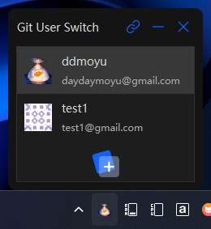

## Git User Switch

git 用户切换工具

### 特色功能
1. 通过托盘图标头像，识别用户身份
2. 鼠标悬浮，显示用户名和邮箱
3. 通过 [Gravatar](https://gravatar.com/) 获取邮箱头像
4. 可增删改 Git 用户，鼠标点击即可立即切换
5. 开机自启
6. 占用 4~6MB 内存

### 说明
1. 只是修改了 git global config 里的名称和邮箱，并不能解决不同用户使用不同 git 平台的功能。
2. 如果头像是随机花纹，则需要去 [Gravatar](https://gravatar.com/) 设置头像后，右键刷新头像